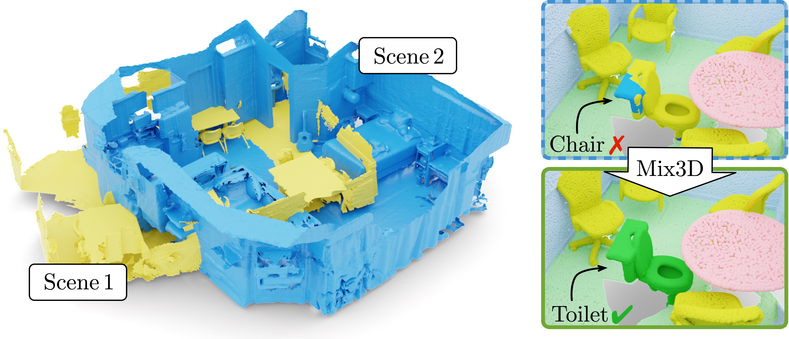
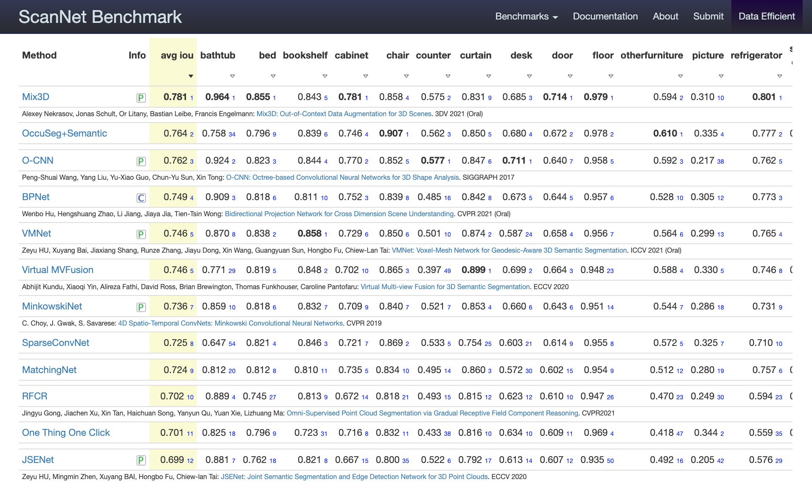

# Mix3D: Out-of-Context Data Augmentation for 3D Scenes (3DV 2021)
<div align="center">
Alexey Nekrasov*, Jonas Schult*, Or Litany, Bastian Leibe, Francis Engelmann

Mix3D is a data augmentation technique for 3D segmentation methods that improves generalization.

[](https://paperswithcode.com/sota/semantic-segmentation-on-scannet?p=mix3d-out-of-context-data-augmentation-for-3d)

<a href="https://pytorch.org/get-started/locally/"></a>
<a href="https://pytorchlightning.ai/"></a>
<a href="https://hydra.cc/"></a>
<a href="https://black.readthedocs.io/en/stable/"></a>



</div>
<br><br>

[[Project Webpage](https://nekrasov.dev/mix3d)] [[arXiv](https://arxiv.org/abs/2110.02210)] [[Demo](https://mix3d-demo.nekrasov.dev/)]

## Demo

We also host a [demo](https://mix3d-demo.nekrasov.dev/) page, where you can upload your scene and in 30 minutes receive a prediction from the model! We created it to collect the most challenging scenes that could be captured in the wild and test the limits of the current SOTA models.   

## News

* **18. April 2022**: For the last Minkowski Engine release use [branch](https://github.com/kumuji/mix3d/tree/dev_MinkowskiEngine054) or [pull request](https://github.com/kumuji/mix3d/pull/11)
* **12. October 2021**: Code released.
* **6. October 2021**: Mix3D accepted for oral presentation at [3DV](https://3dv2021.surrey.ac.uk/) 2021. Paper on [[arXiv]](https://arxiv.org/abs/2110.02210).
* **30. July 2021**: Mix3D ranks 1st on the [ScanNet](http://kaldir.vc.in.tum.de/scannet_benchmark/semantic_label_3d) semantic labeling benchmark.




## Running the code
This repository contains the code for the analysis experiments of section `4.2. Motivation and Analysis Experiments` from the paper
For the ScanNet benchmark and Table 1 (main paper) we use the original [SpatioTemporalSegmentation-Scannet](https://github.com/chrischoy/SpatioTemporalSegmentation-Scannet) code.
To add Mix3D to the original MinkowskiNet codebase, we provide the patch file `SpatioTemporalSegmentation.patch`.
With the patch file `kpconv_tensorflow_mix3d.patch`, you can add Mix3D to the [official TensorFlow code release of KPConv](https://github.com/HuguesTHOMAS/KPConv) on ScanNet and S3DIS.
Analogously, you can patch the [official PyTorch reimplementation of KPConv](https://github.com/HuguesTHOMAS/KPConv-PyTorch) with the patch file `kpconv_pytorch_mix3d.patch`.
Check the supplementary for more details.


### Code structure

```
├── mix3d
│   ├── __init__.py
│   ├── __main__.py     <- the main file
│   ├── conf            <- hydra configuration files
│   ├── datasets
│   │   ├── outdoor_semseg.py       <- outdoor dataset
│   │   ├── preprocessing       <- folder with preprocessing scripts
│   │   ├── semseg.py       <- indoor dataset
│   │   └── utils.py        <- code for mixing point clouds
│   ├── logger
│   ├── models      <- MinkowskiNet models
│   ├── trainer
│   │   ├── __init__.py
│   │   └── trainer.py      <- train loop
│   └── utils
├── data
│   ├── processed       <- folder for preprocessed datasets
│   └── raw     <- folder for raw datasets
├── scripts
│   ├── experiments
│   │   └── 1000_scene_merging.bash
│   ├── init.bash
│   ├── local_run.bash
│   ├── preprocess_matterport.bash
│   ├── preprocess_rio.bash
│   ├── preprocess_scannet.bash
│   └── preprocess_semantic_kitti.bash
├── docs
├── dvc.lock
├── dvc.yaml        <- dvc file to reproduce the data
├── poetry.lock
├── pyproject.toml      <- project dependencies
├── README.md
├── saved       <- folder that stores models and logs
└── SpatioTemporalSegmentation-ScanNet.patch        <- patch file for original repo
```

### Dependencies
The main dependencies of the project are the following:
```yaml
python: 3.7
cuda: 10.1
```
For others, the project uses the [poetry](https://github.com/python-poetry/poetry) dependency management package.
Everything can be installed with the command:
```yaml
poetry install
```
Check `scripts/init.bash` for more details.

### Data preprocessing
After the dependencies are installed, it is important to run the preprocessing scripts.
They will bring `scannet, matterport, rio, semantic_kitti` datasets to a single format.
By default, the scripts expect to find datsets in the `data/raw/` folder.
Check `scripts/preprocess_*.bash` for more details.
```yaml
dvc repro scannet # matterport, rio, semantic_kitti
```
This command will run the preprocessing for scannet and will save the result using the `dvc` data versioning system.

### Training and testing
Train MinkowskiNet on the scannet dataset without Mix3D with a voxel size of 5cm:
```yaml
poetry run train
```
Train MinkowskiNet on the scannet dataset with Mix3D with a voxel size of 5cm:
```yaml
poetry run train data/collation_functions=voxelize_collate_merge
```

## BibTeX
```
@inproceedings{Nekrasov213DV,
  title     = {{Mix3D: Out-of-Context Data Augmentation for 3D Scenes}},
  author    = {Nekrasov, Alexey and Schult, Jonas and Litany, Or and Leibe, Bastian and Engelmann, Francis},
  booktitle = {{International Conference on 3D Vision (3DV)}},
  year      = {2021}
}
```
